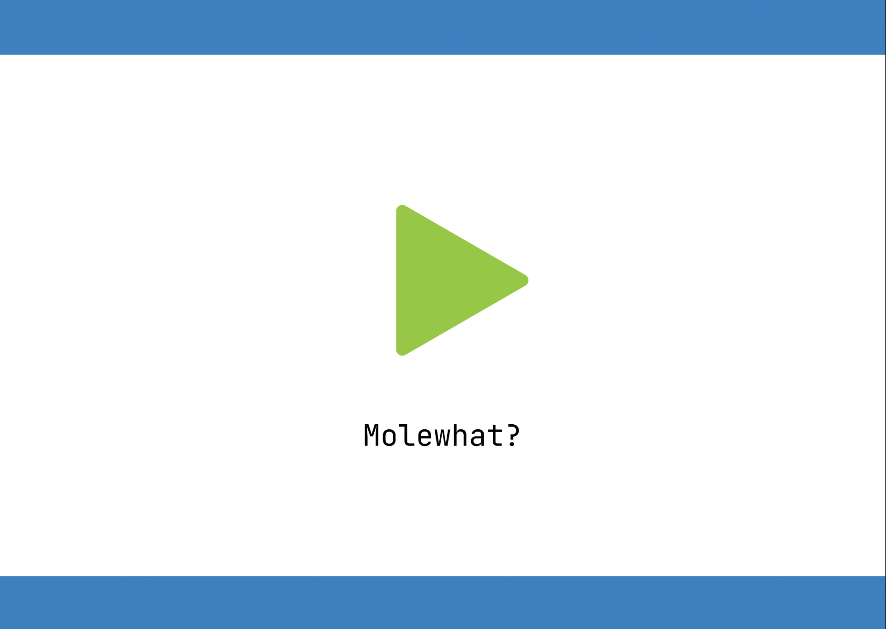
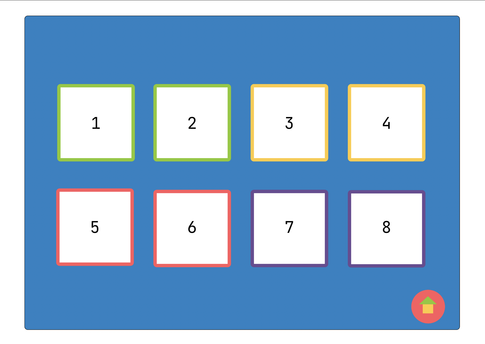
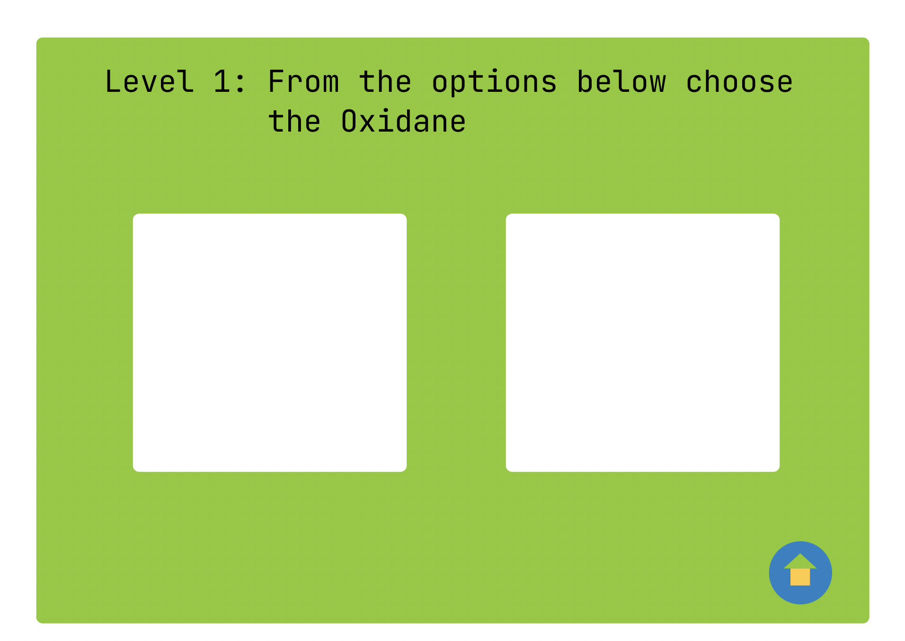
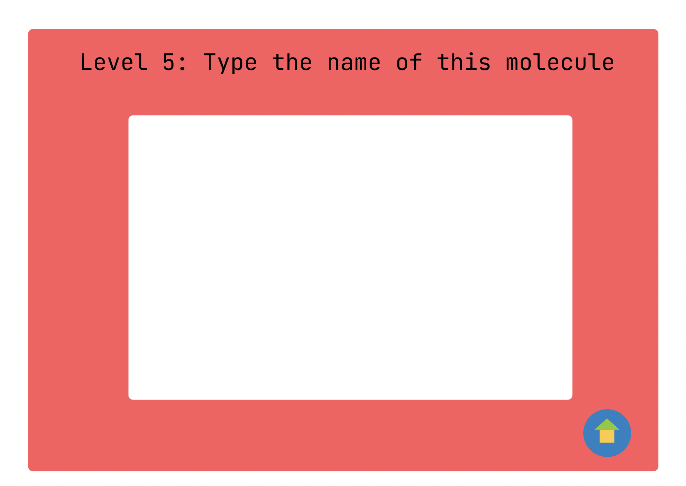

# MoleWhat: The molecule name game

## About

Final Project for the Software Engineering 2022-2 class, taught by Dr. José Alfredo Noriega Carmona at the [National Autonomous University of Mexico](https://www.unam.mx/), in its  National School of Superior-Level Studies, _Morelia_ Campus (ENES Morelia), as part of its _Bs. in Information Technologies applied to Science_ career plan.
> 
> Mariela Yael Arias Rojo ([marielaAriass](https://github.com/marielaAriass))
> 
> Miriam Guadalupe Valdez Maldonado ([mirluvams](https://github.com/mirluvams))
> 
> Karime Ochoa Jacinto ([Kadkam8a](https://github.com/Kadkam8a))
> 
> Luis Aaron Nieto Cruz ([LuisAaronNietoCruz](https://github.com/LuisAaronNietoCruz))
> 
> Anton Pashkov ([anton-pashkov](https://github.com/anton-pashkov))

# User Manual

### Table of Contents
* Introduction
* Objectives
* About documentation
* Toolset - Operational concepts
* Procedure  - Referential mode
* Shortcuts and Commands
* Error messages and Troubleshooting
* Glosary
* Navigation Features

### Introduction
The following project intends to provide a basic game in which chemistry students can study, memorize and learn the molecules names and their descriptions according to the [International Union of Pure and Applied Chemistry](https://iupac.org/).

The need for such a project stems as a desire to help students challenge their knowledge of chemistry, specifically molecules names, through a game that puts their memorization skills to work. There is currently no game that allows you to do this. Studying and memorizing important things is intended to be fun and challenging through the levels that this game offers.

### Objectives
The expected output of this project is to be a software that potential users can download on their own devices and start playing. It will save the personal information of the user locally, not in the cloud.

### About documentation

It is not necessary to have advanced computer knowledge, however, it is recommended to know how to use the terminal of your device to run the program by following the steps that we will provide later. Prior knowledge of molecule names is recommended if you want to use it as a knowledge test, however it can also be played for the purpose of learning from scratch. This is the first version of the game, so don't get surprised if there are not many levels yet.

// advertencias, precauciones, cambios desde la última versión, tabla de volúmenes.

### Toolset - Operational concepts

#### Installation
This program does not require installation. However, it does require the following dependencies installed on the system:
* [Python 3](https://www.python.org/downloads/) | v 3.10.4
* [Guizero](https://pypi.org/project/guizero/) | v 1.3.0 
* [Sqlite3](https://docs.python.org/es/3/library/sqlite3.html) | v. 3.36.0
* [drkit](https://www.rdkit.org/)
* [tkinter](https://docs.python.org/es/3/library/tkinter.html) | v. 8.6
* [PyInstaller](https://pyinstaller.org/en/stable/)

Run your executable to get started as quickly as possible by doing the following:
* Unzip the folder.
* Open the folders.
* Allow execute, read and write permissions.

#### Uninstallation
Simply remove the directory, and if possible, remove dependencies as well.

#### Usage
No login required. The player's progress is saved locally in the database.

##### About the interface

* Home page

* Levels page

* The game is divided into two different type of questions. This one is an example of matching the correct image with the molecule name:

* In this other one, you got to type the correct molecula name based on the showed image.

* In addition, it contains a button that takes you directly to the home page. It is located in the bottom right.
 
### Procedure  - Referential mode
To start playing MoleWhat it is necessary to run the aforementioned folders, the graphic window will open and the home page will be presented, the "play" icon will be displayed, this button has to be pressed to redirect you to the list of levels, being there, you select the one you want to play, after selecting the correct level, the first question will be displayed on the screen.

### Shortcuts and commands
There is not any yet but adding some in the near future.

### Error messages and Troubleshooting
First, try running the executable from a terminal so you can see all the output. Remember to remove the -w build flag to see all the stdout in a console window. Often, you’ll see ImportError exceptions if a dependency is missing.

### Glosary
> IUPAC: "Advancing the Worldwide Role of Chemistry", IUPAC serves the international scientific endeavor in the dual function of a fundamental science and mission-oriented Union. The Union is in a unique position to contribute to the central interdisciplinary chemical sciences.
> 
> Molecule: A group of atoms bonded together, representing the smallest fundamental unit of a chemical compound that can take part in a chemical reaction.
> 
### Navigation Features
* Graphic window: with a simple interface design to avoid confusion and difficulties for the users.

The contents of this repository are licensed under the GNU General Public License version 3. Visit https://www.gnu.org/licenses/gpl-3.0.html for more information.

